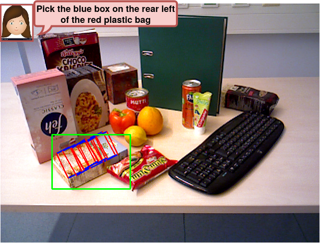

# PanguCROG-NPU: Language-guided Robot Grasping

Created by Georgios Tziafas, Yucheng XU, Arushi Goel, Mohammadreza Kasaei, Zhibin Li, Hamidreza Kasaei

This maintained fork exposes every model through a Pangu-prefixed public name,
such as `PanguCROG`, `PanguDROG`, and `PanguMapleGrasp`. Legacy names remain
available so existing checkpoints, scripts, and experiments continue to work.

This is an official PyTorch implementation of the baseline end-to-end model [CROG](https://arxiv.org/abs/2311.05779) of our work. The implementation of our CROG model is based on the [CRIS](https://github.com/DerrickWang005/CRIS.pytorch) model, thanks for their amazing work! :beers:

Robots operating in human-centric environments require the integration of visual grounding and grasping capabilities to effectively manipulate objects based on user instructions. This work focuses on the task of referring grasp synthesis, which predicts a grasp pose for an object referred through natural language in cluttered scenes. Existing approaches often employ multi-stage pipelines that first segment the referred object and then propose a suitable grasp, and are evaluated in private datasets or simulators that do not capture the complexity of natural indoor scenes. To address these limitations, we develop a challenging benchmark based on cluttered indoor scenes from OCID dataset, for which we generate referring expressions and connect them with 4-DoF grasp poses. Further, we propose a novel end-to-end model (CROG) that leverages the visual grounding capabilities of CLIP to learn grasp synthesis directly from image-text pairs. Our results show that vanilla integration of CLIP with pretrained models transfers poorly in our challenging benchmark, while CROG achieves significant improvements both in terms of grounding and grasping. Extensive robot experiments in both simulation and hardware demonstrate the effectiveness of our approach in challenging interactive object grasping scenarios that include clutter.


**Check our demo video [here](https://www.youtube.com/watch?v=D3auLBUX-EM&t=5s)**

## Example
<p align="center">
  
</p>


## News
- :sunny: [Aug 30, 2023] Our paper was accepted by CoRL-2023.


## Preparation

1. Environment
   - use the environment.yml file to create the conda env.
2. Datasets
   - The detailed instruction is in [OCID-VLG](https://github.com/gtziafas/OCID-VLG) repo.

## Quick Start

This implementation only supports **multi-gpu**, **DistributedDataParallel** training, which is faster and simpler; single-gpu or DataParallel training is not supported. Besides, the evaluation only supports single-gpu mode. In our case, we train the CROG on 2 RTX-4090 GPUs. The training procedure takes around 3.5 hours. To do training of CROG with 2 GPUs, run:

```
python -u train_crog.py --config config/OCID-VLG/pangu_crog_multiple_r50.yaml
```

To do training of SSG with 2 GPUs, run:
```
python -u train_ssg.py --config config/OCID-Grasp/pangu_ssg_r50.yaml
```

**Please remember to modify the path to the dataset in config files.**

## Ascend NPU port

### Pangu-prefixed model namespace

New experiments should use the Pangu-prefixed YAML files. The model factory
accepts both namespaces:

| Pangu name | Legacy alias |
| --- | --- |
| `pangu_crog` | `crog` |
| `pangu_drog` | `drog` |
| `pangu_drogoff` | `drogoff` |
| `pangu_maplegrasp` | `maplegrasp` |
| `pangu_etrg`, `pangu_ggcnnclip`, `pangu_grconvnetclip` | corresponding legacy name |
| `pangu_graspmamba`, `pangu_lgd`, `pangu_crogoff` | corresponding legacy name |

Dataset names, paths, and annotation formats are unchanged.

Every YAML under `config/` sets both training and validation batch size to
`32`. CROG and DROG use Adam at `1e-4`; DROG-OFF uses `4e-4`. Every profile
runs for 24 epochs with one learning-rate milestone at epoch 15.
All `train_crog.py` YAML profiles use `val_start_epoch: 11` and `val_freq: 1`:
epochs 1-10 train without validation, then epochs 11-24 validate every epoch.
`latest_model.pth` is atomically replaced after every epoch, while scheduled
recovery checkpoints are retained at epochs 5 and 10. When evaluation reports
both J@1 and J@5, independent metric-labelled `best_j1_epoch_*.pth` and
`best_j5_epoch_*.pth` checkpoints are maintained. VCoT's single GraspSR metric
continues to use `best_epoch_*_GraspSR_*.pth`. Each training launch appends a
millisecond timestamp to `TRAIN.exp_name` and therefore writes to a new
directory, including resume
launches. For example:

```text
exp/ocid_vlg/ggcnnclip_ocid_vlg_8npu_20260731_143025_123/
epoch_005_model.pth
epoch_010_model.pth
latest_model.pth
best_j1_epoch_011_J1_90.92_J5_93.69.pth
best_j5_epoch_014_J1_90.71_J5_94.03.pth
```

Pure segmentation stages use `best_epoch_011_IoU_80.60.pth`. MapleGrasp
Stage 2 automatically resolves its legacy Stage-1 path to the newest
timestamped epoch+IoU checkpoint.
Only the accelerator/runtime path is changed:

- explicit `torch_npu` device calls instead of CUDA calls;
- HCCL and `torchrun` instead of NCCL and the in-process GPU launcher;
- full FP32 on Ascend because AMP caused gradient overflow;
- per-rank BatchNorm instead of SyncBatchNorm. The latter is deliberately
  disabled because torch_npu SyncBatchNorm can produce device-side
  AIVector/MTE faults during multi-NPU training;
- CPU checkpoint loading followed by explicit optimizer-state migration;
- per-tensor Adam updates by default (`foreach=False`) to avoid Ascend
  `ForeachAddListV2` dynamic-kernel failures.

Install the PyTorch/torch_npu pair matching the server's CANN release, then:

```bash
source /usr/local/Ascend/ascend-toolkit/set_env.sh
pip install -r requirements-npu.txt
# ETRG only: install the torchvision wheel matching this PyTorch build.
python tools/check_npu_env.py
```

Place OCID-VLG at `datasets/OCID-VLG`. CROG is RGB-only, so the training
dataset does not need a `depth/` directory and depth images are never loaded.
The training launcher automatically
downloads the official OpenAI CLIP RN50 checkpoint to `pretrain/RN50.pt` when
it is absent and verifies its SHA-256 before training. Run the original CROG
experiment on eight NPUs with:

```bash
bash tools/train_8npu.sh config/OCID-VLG/pangu_crog_multiple_r50.yaml
```

Every training profile uses the same launcher and passes exactly one YAML path
as its positional argument. The YAML fixes `TRAIN.amp: False`, and the launcher
does not override it.

The FP32 path bypasses both autocast and `torch_npu.npu.amp.GradScaler`; it
uses ordinary `loss.backward()` and `optimizer.step()` so a disabled scaler
cannot still enter an Ascend overflow-status check.

Evaluate a CROG checkpoint on one NPU with:

```bash
ASCEND_RT_VISIBLE_DEVICES=0 python3 test_crog.py \
  --config config/OCID-VLG/pangu_crog_multiple_r50.yaml \
  --opts DATA.root_path datasets/OCID-VLG \
         TRAIN.resume exp/OCID-VLG_multiple_npu/CROG_official_multiple_R50_8npu/best_epoch_XXX_J1_XX.XX_J5_XX.XX.pth \
         TEST.test_split test
```

For eight-NPU evaluation, the dataset is sharded without padding and the
metrics are summed with HCCL:

```bash
ASCEND_RT_VISIBLE_DEVICES=0,1,2,3,4,5,6,7 torchrun \
  --standalone --nproc_per_node=8 test_crog.py \
  --config config/OCID-VLG/pangu_crog_multiple_r50.yaml \
  --opts DATA.root_path datasets/OCID-VLG \
         TRAIN.resume exp/OCID-VLG_multiple_npu/CROG_official_multiple_R50_8npu/best_epoch_XXX_J1_XX.XX_J5_XX.XX.pth \
         TEST.test_split test
```


## VCoT/Grasp-Anything DROG-OFF

`config/vcot/pangu_drogoff.yaml` trains DROG-OFF on the compact VCoT subset. The
default data root is `datasets/graspanything-vcot` and must contain:

```text
datasets/graspanything-vcot/
├── image/*.jpg
├── mask/*.npy
├── grasp_label_positive/*.pt
└── split/vcot/{train,test_seen,test_unseen}.csv
```

Training uses the official `train.csv` split and validates on `test_unseen.csv`.
It keeps the repository-wide 24-epoch schedule: no validation in epochs 1-10,
recovery checkpoints at epochs 5 and 10, and validation every epoch from 11.
The global batch size is 32 and the learning rate is `4e-4`.

Train on eight NPUs:

```bash
bash tools/train_8npu.sh config/vcot/pangu_drogoff.yaml
```

For a non-default location, set `DATA_ROOT` (and optionally `SPLIT_ROOT`) before
the same command. Train on one selected NPU with:

```bash
ASCEND_RT_VISIBLE_DEVICES=3 python3 train_crog.py --config config/vcot/pangu_drogoff.yaml
```

For VCoT, both `config/vcot/pangu_crog.yaml` and `config/vcot/pangu_drogoff.yaml`
predict the long and short grasp-rectangle sides. The optional CROG short-side
head is disabled by default for legacy OCID-VLG and Grasp-Tools checkpoints.

VCoT evaluation uses the public paper protocol rather than CROG's historical
raster scorer: exactly one predicted grasp, continuous rotated-rectangle IoU
`>= 0.25`, and 180-degree-periodic angle difference `<= 30` degrees. The metric
is logged as `GraspSR`. Training keeps `latest_model.pth`, an independent
best-IoU checkpoint, the rolling best GraspSR checkpoint named like
`best_epoch_011_GraspSR_72.34.pth`, and the five strongest validation GraspSR
checkpoints named `top_graspsr_epoch_*.pth`. Change `TRAIN.grasp_sr_topk` to
adjust the retained ranking size. Top-k files use hard links when the filesystem
supports them, so aliases of the same epoch do not duplicate checkpoint data.
When resuming into a new timestamped run directory, ranked files recorded in
the checkpoint are linked or copied forward automatically. Evaluate the unseen
split with:

```bash
ASCEND_RT_VISIBLE_DEVICES=3 python3 test_crog.py \
  --config config/vcot/pangu_drogoff.yaml \
  --opts TRAIN.resume exp/vcot/drogoff_vcot_8npu_TIMESTAMP/best_epoch_XXX_GraspSR_XX.XX.pth
```

The existing `config/OCID-VLG/*.yaml` profiles continue to use the unchanged
CROG legacy J@1/J@5 evaluation path.

## DROG and DROG-OFF with the CROG scoring protocol
`config/OCID-VLG/pangu_drog.yaml` and `config/OCID-VLG/pangu_drogoff.yaml` select the
DINOv2/CLIP-B16 models. DROG-OFF keeps its offset post-processing, while all
resulting grasp rectangles are judged by CROG's scoring functions. The launcher
checks `pretrain/` and automatically downloads either missing official backbone
before starting `torchrun`. Direct model construction performs the same check.

Train DROG on eight NPUs:

```bash
bash tools/train_8npu.sh config/OCID-VLG/pangu_drog.yaml
```

Train DROG-OFF with the same launcher:

```bash
bash tools/train_8npu.sh config/OCID-VLG/pangu_drogoff.yaml
```

Evaluate a DROG checkpoint on one NPU:

```bash
ASCEND_RT_VISIBLE_DEVICES=0 python3 test_crog.py \
  --config config/OCID-VLG/pangu_drog.yaml \
  --opts TRAIN.resume exp/OCID-VLG/drog_ocid_vlg_8npu/best_epoch_XXX_J1_XX.XX_J5_XX.XX.pth
```

Use `config/OCID-VLG/pangu_drogoff.yaml` and the matching checkpoint for DROG-OFF.
Eight-NPU evaluation uses the same `torchrun --nproc_per_node=8 test_crog.py`
form documented above for CROG.

This comparison intentionally preserves every historical CROG evaluation
operation: bicubic resizing with `align_corners=True`, OpenCV cubic inverse
warping, the 0.35 segmentation threshold, quality peaks at 0.4 with distance
2, top-1/top-5 detection, the fixed 480x640 raster canvas, predicted grasp
height 20, ground-truth height overwritten to 20, ground-truth width clipped
to 100, the original periodic-angle test, and strict `IoU > 0.25`. DROG-OFF's
offset head is supervised during training and refines the predicted center (plus
angle/width resampling) before the resulting rectangle is passed to the unchanged
CROG Jacquard scorer.

## DROG-OFF inference ablations

The following evaluation-only profiles reuse the same trained DROG-OFF
checkpoint; neither changes the model, offset loss, or checkpoint keys.

| Profile | Predicted-mask centre filter | Offset refinement |
| --- | --- | --- |
| `drogoff.yaml` | off | on |
| `drogoff_mask_filter.yaml` | on | on |
| `drogoff_no_offset.yaml` | off | off |

The mask-filter profile first suppresses grasp-quality peaks outside the
thresholded predicted segmentation mask. After offset refinement, it checks the
final rectangle centre again on the same original-image canvas and retains only
centres inside that predicted mask. The no-offset profile still computes the
offset head but ignores its output (and geometry resampling) during validation
and testing.

Evaluate both ablations on one NPU with the baseline checkpoint:

```bash
ASCEND_RT_VISIBLE_DEVICES=0 python3 test_crog.py --config config/OCID-VLG/pangu_drogoff_mask_filter.yaml --opts TRAIN.resume exp/OCID-VLG/drogoff_ocid_vlg_8npu/best_epoch_XXX_J1_XX.XX_J5_XX.XX.pth
ASCEND_RT_VISIBLE_DEVICES=0 python3 test_crog.py --config config/OCID-VLG/pangu_drogoff_no_offset.yaml --opts TRAIN.resume exp/OCID-VLG/drogoff_ocid_vlg_8npu/best_epoch_XXX_J1_XX.XX_J5_XX.XX.pth
```

Change only the `TRAIN.resume` path if the baseline checkpoint is stored
elsewhere. Because these are inference ablations, retraining them would produce
the same learned DROG-OFF model.

## Automatic pretrained weights

List every registered filename and official URL:

```bash
python3 tools/download_pretrained.py
```

Download the CROG/DROG backbones in advance (optional):

```bash
python3 tools/download_pretrained.py clip-rn50 clip-vit-b16 dinov2-vitb14-reg4 resnet18
```

| Key | File | Official source |
| --- | --- | --- |
| `clip-rn50` | `RN50.pt` | [OpenAI CLIP RN50](https://openaipublic.azureedge.net/clip/models/afeb0e10f9e5a86da6080e35cf09123aca3b358a0c3e3b6c78a7b63bc04b6762/RN50.pt) |
| `clip-rn101` | `RN101.pt` | [OpenAI CLIP RN101](https://openaipublic.azureedge.net/clip/models/8fa8567bab74a42d41c5915025a8e4538c3bdbe8804a470a72f30b0d94fab599/RN101.pt) |
| `clip-vit-b16` | `ViT-B-16.pt` | [OpenAI CLIP ViT-B/16](https://openaipublic.azureedge.net/clip/models/5806e77cd80f8b59890b7e101eabd078d9fb84e6937f9e85e4ecb61988df416f/ViT-B-16.pt) |
| `dinov2-vitb14-reg4` | `dinov2_vitb14_reg4_pretrain.pth` | [Meta DINOv2 ViT-B/14 Registers](https://dl.fbaipublicfiles.com/dinov2/dinov2_vitb14/dinov2_vitb14_reg4_pretrain.pth) |
| `mambavision-t` | `mambavision_tiny_1k.pth.tar` | [NVIDIA MambaVision-T](https://huggingface.co/nvidia/MambaVision-T-1K/resolve/main/mambavision_tiny_1k.pth.tar) |
| `resnet18` | `resnet18-f37072fd.pth` | [PyTorch ResNet-18](https://download.pytorch.org/models/resnet18-f37072fd.pth) |

Existing non-empty DINOv2 files are reused; CLIP, MambaVision, and ResNet
files are additionally checksum-verified. Downloads use a lock and an atomic rename,
so multi-process evaluation cannot consume a partial file. On failure, the error
prints the same official URL for manual download.

### HTTPS certificate errors

If the server uses an HTTPS-inspecting proxy, point the downloader at the
organization's PEM CA certificate:

```bash
export CROG_NPU_CA_BUNDLE=/path/to/company-ca.pem
bash tools/train_8npu.sh config/OCID-VLG/pangu_drogoff.yaml
```

The downloader also recognizes `SSL_CERT_FILE`, `REQUESTS_CA_BUNDLE`, and
`CURL_CA_BUNDLE`. If the CA certificate is unavailable, the explicit emergency
fallback below disables TLS verification and must only be used on a trusted
network:

```bash
CROG_NPU_INSECURE_DOWNLOAD=1 \
  bash tools/train_8npu.sh config/OCID-VLG/pangu_drogoff.yaml
```

For a one-off manual download, use `--ca-bundle FILE` or `--insecure`.


Custom locations can be supplied without editing files:

```bash
DATA_ROOT=/data/OCID-VLG CLIP_WEIGHT=/data/RN50.pt \
  bash tools/train_8npu.sh config/OCID-VLG/pangu_crog_multiple_r50.yaml
```

## MapleGrasp official two-stage NPU flow

The MapleGrasp implementation follows the official
[`vineet2104/MapleGrasp`](https://github.com/vineet2104/MapleGrasp) release at
commit `c1b1f48e7ff24caaf39daa127d47d9469b93c7a1`. It preserves the official
CLIP-RN50/FPN/transformer structure, projector parameter names, weighted BCE
segmentation loss, four Smooth-L1 grasp losses, detached hard mask gate at
`0.35`, and the required two-stage training order. NPU/HCCL execution, a
shape-safe gate resize, and an Ascend-safe fused grouped convolution are the
runtime adaptations.

Train Stage 1 (referred-object segmentation) first:

```bash
bash tools/train_8npu.sh config/OCID-VLG/pangu_maplegrasp_stage1.yaml
```

Then train Stage 2. Its YAML uses `TRAIN.weight` to load Stage 1's
`best_iou_model.pth` with `strict=False`; only the new `proj.vis_grasp` weights
may be missing, matching the official flow:

```bash
bash tools/train_8npu.sh config/OCID-VLG/pangu_maplegrasp_stage2.yaml
```

`TRAIN.weight` is only for the Stage-1-to-Stage-2 transition. To continue an
interrupted Stage 1 or Stage 2 run, leave `weight` empty and set `TRAIN.resume`
to that stage's `epoch_010_model.pth` (or its current `best_epoch_*.pth`).
`config/OCID-VLG/pangu_maplegrasp.yaml` is a Stage-1-compatible alias.

### VCoT extension

The VCoT extension preserves MapleGrasp's two-stage mask-guided pooling flow.
Stage 1 remains segmentation-only. Stage 2 optionally expands the official
four grasp maps with a predicted short-side map, so the output is mask,
quality, sine, cosine, long side, and short side. Legacy OCID-VLG configs and
checkpoint shapes remain unchanged.

Train the VCoT segmentation stage first:

```bash
bash tools/train_8npu.sh config/vcot/pangu_maplegrasp_stage1.yaml
```

Then train the VCoT grasp stage from the best Stage-1 IoU checkpoint:

```bash
bash tools/train_8npu.sh config/vcot/pangu_maplegrasp_stage2.yaml
```

The VCoT Stage-2 profile uses `grasp_size_factor: 300`, applies sigmoid to
both size maps in the Smooth-L1 loss, records sigmoid checkpoint metadata for
matched inference, validates with the official single-grasp protocol on Seen,
and defaults standalone testing to Unseen.

The upstream README names a MapleGrasp YAML that is not present in its released
git tree. Consequently, this port keeps the CROG schedule used by the model
base optimizer (Adam at `1e-4`); its schedule follows the repository-wide
24-epoch, milestone-15 experiment setting.

## ToolRGSNPU model comparison under the CROG protocol

The compatible RGB model implementations from ToolRGSNPU commit
`c9b1af73ac359c14c13dbd0acb8492f8af3d6075` are isolated under
`model/toolrgs/`. The original `model/crog.py`, `model/clip.py`, and
`model/layers.py` remain the default CROG implementation.

Available comparison configurations are:

- `crogoff`, `drog`, `drogoff`;
- `etrg` (RGB-only ETRG-R50; requires matching `torchvision`);
- `ggcnnclip`, `grconvnetclip`;
- `lgd`, `maplegrasp`;
- `graspmamba` (optional `mambavision` dependency and operator compatibility).

These configurations are deliberately locked to `evaluation_protocol:
crog_legacy`. They use the same OCID-VLG split and preprocessing as CROG, mask
threshold `0.35`, cubic inverse warp, sigmoid decoding only for segmentation,
quality and width, raw sine/cosine angle decoding, Top-1/Top-5 proposals, and
the original CROG Jacquard test. CROGOFF and DROGOFF additionally translate
the predicted grasp centre using their offset map before that same Jacquard
test; the angle, width, thresholds and success criterion are unchanged.

Run one model on eight NPUs with:

```bash
bash tools/train_toolrgs_model_8npu.sh drog
bash tools/train_toolrgs_model_8npu.sh drogoff
bash tools/train_toolrgs_model_8npu.sh etrg
```

The launcher downloads and verifies the backbone weights required by the
selected model. `TRAIN.batch_size` in every YAML is the global batch size and
is divided across the eight processes by `train_crog.py`.

ETRG uses the same CROG legacy evaluator and OCID-VLG RGB input. Its
auxiliary ResNet-18 consumes RGB rather than depth, and the launcher
downloads both `RN50.pt` and `resnet18-f37072fd.pth` automatically.


## License

This project is under the MIT license. See [LICENSE](LICENSE) for details.

## Citation
If you find our work useful in your research, please consider citing:
```
@inproceedings{tziafas2023language,
  title={Language-guided Robot Grasping: CLIP-based Referring Grasp Synthesis in Clutter},
  author={Tziafas, Georgios and Yucheng, XU and Goel, Arushi and Kasaei, Mohammadreza and Li, Zhibin and Kasaei, Hamidreza},
  booktitle={7th Annual Conference on Robot Learning},
  year={2023}
}

@inproceedings{10161149,
  author={Xu, Yucheng and Kasaei, Mohammadreza and Kasaei, Hamidreza and Li, Zhibin},
  booktitle={2023 IEEE International Conference on Robotics and Automation (ICRA)},
  title={Instance-wise Grasp Synthesis for Robotic Grasping},
  year={2023},
  volume={},
  number={},
  pages={1744-1750},
  keywords={Automation;Object detection;Grasping;Benchmark testing;Feature extraction;Cleaning;Task analysis},
  doi={10.1109/ICRA48891.2023.10161149}}
```
